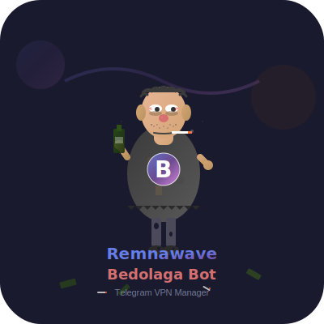

# 🚀 Remnawave Bedolaga Bot

<div align="center">



**🤖 Современный Telegram-бот для управления VPN подписками через Remnawave API**

*Полнофункциональное решение с управлением пользователями, платежами и администрированием*

[](https://python.org)
[](https://postgresql.org)
[](LICENSE)
[](https://github.com/Fr1ngg/remnawave-bedolaga-telegram-bot/stargazers)

[🚀 Быстрый старт](#-быстрый-старт) • [📖 Функционал](#-функционал) • [🐳 Docker](#-docker-развертывание) • [💻 Локальная разработка](#-локальная-разработка) • [💬 Поддержка](#-поддержка-и-сообщество)

</div>

---

## 🧪 [Тестирование бота](https://t.me/FringVPN_bot)

## 💬 **[Bedolaga Chat](https://t.me/+wTdMtSWq8YdmZmVi)** - Для общения, вопросов, предложений

---

## 🌟 Почему Bedolaga?

Бот Бедолага не добрый и не милый.
Он просто делает вашу работу вместо вас, принимает оплату, выдаёт подписки, интегрируется с Remnawave и тихо ненавидит всех, кто ещё не подключил его.

Вы хотите продавать VPN — Бедолага позволит это делать.
Вы хотите спать — он позволит и это.

### ⚡ **Полная автоматизация VPN бизнеса**
- 🎯 **Готовое решение** - разверни за 5 минут, начни продавать сегодня
- 💰 **Многоканальные платежи** - Telegram Stars + Tribute + CryptoBot + ЮKassa + MulenPay + PayPalych + P2P
- 🔄 **Автоматизация 99%** - от регистрации до продления подписок
- 📊 **Детальная аналитика** - полная картина вашего бизнеса
- 💬 **Уведомления в топики** об: Активация триала 💎 Покупка подписки 🔄 Конверсия из триала в платную ⏰ Продление подписки 💰 Пополнение баланса 🚧 Включении тех работ ♻️ Появлении новой версии бота
  
### 🎛️ **Гибкость конфигурации**
- 🌍 **Умный выбор серверов** - автоматический пропуск при одном сервере, мультивыбор при нескольких
- 📱 **Управление устройствами** - от 1 до неограниченного количества
- 📊 **Режимы продажи трафика** - фиксированный лимит или выбор пакетов
- 🎁 **Промо-система** - коды на деньги, дни подписки, триал-периоды
- 🔧 **Гибкие тарифы** - от 5GB до безлимита, от 14 дней до года

### 💪 **Enterprise готовность**
- 🏗️ **Современная архитектура** - AsyncIO, PostgreSQL, Redis
- 🔒 **Безопасность** - интеграция с системой защиты панели через куки-аутентификацию
- 📈 **Масштабируемость** - от стартапа до крупного бизнеса
- 🔧 **Мониторинг** - автоматическое управление режимом тех. работ
- 🛡️ **Защита панели** - поддержка [remnawave-reverse-proxy](https://github.com/eGamesAPI/remnawave-reverse-proxy)
- 🗄️ **Бекапы/Восстановление** - автобекапы и восстановление бд прямо в боте с уведомления в топики
- ✍️ **Проверка на подписку** - проверяет подписку на канал 

### 📚 Поддерживаемые методы авторизации

Метод | Заголовок | Описание
-- | -- | --
API Key | X-Api-Key: your_api_key | Стандартный API ключ
Bearer Token | Authorization: Bearer token | Классический Bearer token
Basic Auth | X-Api-Key: Basic base64(user:pass) | Basic Authentication
eGames Cookies | Cookies в формате key:value | Для панелей eGames


---

## 🚀 Быстрый старт

### 🧙‍♂️ Автоустановка через `install_bot.sh`

Скрипт-установщик берёт на себя подготовку окружения, настройку конфигурации и дальнейшее обслуживание бота. Он работает поверх Docker Compose и требует заранее установить:

- **Docker Engine** и **Docker Compose plugin** (2.20+);
- **Git** и **Bash** (по умолчанию есть в большинстве Linux дистрибутивов);
- `openssl` (используется для генерации токенов, но не обязателен — при отсутствии скрипт использует `urandom`).

```bash
# 1. Скачай репозиторий
git clone https://github.com/Fr1ngg/remnawave-bedolaga-telegram-bot.git
cd remnawave-bedolaga-telegram-bot

# 2. Создай необходимые директории
mkdir -p ./logs ./data ./data/backups ./data/referral_qr
chmod -R 755 ./logs ./data
sudo chown -R 1000:1000 ./logs ./data

# 3. Запусти мастер установки
chmod +x install_bot.sh   # один раз, если файл не исполняемый
./install_bot.sh
```

На первом запуске мастер:

1. Спросит путь установки и сохранит его в `./.bot_install_state` — можно оставлять путь по умолчанию (текущая директория).
2. Поможет собрать `.env`: запросит обязательные токены (бот, Remnawave, админы), при необходимости сгенерирует Web API и PostgreSQL пароли, предложит авторизацию Basic Auth или eGames secret.
3. Подготовит структуру каталогов (`logs`, `data`, `backups` и т. д.) и проверит, что Docker готов к запуску.
4. Создаст (или обновит) `docker-compose.yml`, настроит внешнюю сеть `bot_network`, чтобы дальнейшие сервисы (например, Caddy) могли подключаться.
5. Запустит контейнеры бота, PostgreSQL и Redis и выведет их статус.

После установки повторный запуск `./install_bot.sh` открывает **интерактивное меню управления**:

- 📊 Мониторинг состояния контейнеров и ресурсов.
- ⚙️ Управление сервисами (запуск/остановка/пересборка).
- 📋 Просмотр и поиск по логам.
- 🔄 Обновление проекта из Git с автоматическим бэкапом.
- 💾 Создание и 📦 восстановление резервных копий (включая базу данных).
- 🧹 Очистка логов, бэкапов и образов.
- 🌐 Помощник настройки обратного прокси Caddy (webhook + miniapp, обновление `docker-compose`, перезагрузка).
- ⚙️ Конфигуратор `.env` (редактирование, пересоздание, маскировка секретов).

> 💡 Скрипт можно запускать сколько угодно раз — он хранит путь установки и понимает, когда конфигурация уже создана. Меню работает и по SSH (достаточно TTY), а для скриптов можно передать путь установки через stdin.

### 🐳 Ручной Docker запуск

Если не хочется пользоваться мастером, можно настроить всё вручную:

```bash
# 1. Скачай репозиторий
git clone https://github.com/Fr1ngg/remnawave-bedolaga-telegram-bot.git
cd remnawave-bedolaga-telegram-bot

# 2. Настрой конфиг
cp .env.example .env
nano .env  # Заполни токены и настройки

# 3. Создай необходимые директории
mkdir -p ./logs ./data ./data/backups ./data/referral_qr
chmod -R 755 ./logs ./data
sudo chown -R 1000:1000 ./logs ./data

# 4. Запусти всё разом
docker compose up -d

# 5. Проверь статус
docker compose logs
```

---

## 🌐 Настройка обратного прокси и доменов

> Этот раздел описывает полноценную ручную настройку обратного прокси для **двух разных доменов**: отдельный домен для вебхуков
> (`hooks.example.com`) и отдельный домен для мини-приложения (`miniapp.example.com`). Оба прокси-сервера (Caddy или nginx) дол
> жны работать в одной Docker-сети с ботом, чтобы обращаться к сервису по внутреннему имени `remnawave_bot` без проброса порто
> в наружу.

### 1. Планирование доменов и переменных окружения

1. Добавьте в DNS по **A/AAAA-записи** для обоих доменов на IP сервера, где запущен бот.
2. Убедитесь, что входящий трафик на **80/tcp и 443/tcp** открыт (брандмауэр, облачный фаервол).
3. В `.env` пропишите корректные URL, чтобы бот формировал ссылки с HTTPS-доменами:
   ```env
   WEBHOOK_URL=https://hooks.example.com
   WEB_API_ENABLED=true
   WEB_API_ALLOWED_ORIGINS=https://miniapp.example.com
   MINIAPP_CUSTOM_URL=https://miniapp.example.com
   ```
   При необходимости добавьте пути для дополнительных провайдеров (`TRIBUTE_WEBHOOK_PATH`, `YOOKASSA_WEBHOOK_PATH` и т. д.) —
   далее в конфигурациях мы их пробрасываем на соответствующие порты контейнера бота.

### 2. Общая Docker-сеть для бота и прокси

`docker-compose.yml` бота создаёт сеть `bot_network`. Чтобы внешний прокси видел сервис `remnawave_bot`, нужно:

```bash
# Если бот уже запущен через docker compose up -d
docker compose ps

# Убедиться, что сеть существует
docker network ls | grep bot_network || docker network create bot_network

# Подключить прокси (если контейнер уже запущен отдельно)
docker network connect bot_network <proxy_container_name>
```

Если прокси запускается через **собственный docker-compose**, в файле нужно объявить ту же сеть как внешнюю:

```yaml
networks:
  bot_network:
    external: true
```

Именно так поступает мастер `install_bot.sh`: при первичной установке он создаёт `bot_network` и при повторном запуске в меню №
8 («🌐 Настройка обратного прокси (Caddy)») может автоматически подготовить `docker-compose` и `Caddyfile`, обновить сеть и пер
езапустить сервис.

### 3. Ручная установка Caddy в Docker

1. Создайте каталог для конфигурации:
   ```bash
   mkdir -p ~/caddy
   cd ~/caddy
   ```
2. Сохраните docker-compose-файл `docker-compose.caddy.yml`:
   ```yaml
   services:
     caddy:
       image: caddy:2-alpine
       container_name: remnawave_caddy
       restart: unless-stopped
       ports:
         - "80:80"
         - "443:443"
       volumes:
         - ./Caddyfile:/etc/caddy/Caddyfile
         - caddy_data:/data
         - caddy_config:/config
        # Укажите путь к каталогу miniapp из репозитория бота
        - /root/remnawave-bedolaga-telegram-bot/miniapp:/miniapp:ro
        - /root/remnawave-bedolaga-telegram-bot/miniapp/redirect:/miniapp/redirect:ro
       networks:
         - bot_network

   volumes:
     caddy_data:
     caddy_config:

   networks:
     bot_network:
       external: true
   ```
3. Создайте `Caddyfile` с двумя виртуальными хостами:
   ```caddy
   webhook.domain.com {
    handle /tribute-webhook* {
        reverse_proxy localhost:8081
    }
    
    handle /cryptobot-webhook* {
        reverse_proxy localhost:8081
    }
    
    handle /mulenpay-webhook* {
        reverse_proxy localhost:8081
    }
    
    handle /pal24-webhook* {
        reverse_proxy localhost:8084
    }
    
    handle /yookassa-webhook* {
        reverse_proxy localhost:8082
    }
    
    handle /health {
        reverse_proxy localhost:8081/health
       }
   }
  
    miniapp.domain.com {
        encode gzip zstd
        root * /var/www/remnawave-miniapp
        file_server
      
        @config path /app-config.json
        header @config Access-Control-Allow-Origin "*"
        
        # Redirect for /miniapp/redirect/index.html
        @redirect path /miniapp/redirect/index.html
        redir @redirect /miniapp/redirect/index.html permanent
        
        reverse_proxy /miniapp/* 127.0.0.1:8080 {
            header_up Host {host}
            header_up X-Real-IP {remote_host}
        }
    }
   ```
  - Каталог `miniapp` из репозитория должен быть смонтирован в контейнер Caddy по путям `/miniapp` и `/miniapp/redirect`,
    чтобы статические файлы мини-приложения и страницы редиректа отдавались без дополнительной сборки. Замените
    `/root/remnawave-bedolaga-telegram-bot` в примере на реальный путь до установленного репозитория.
   - Caddy автоматически выпустит TLS-сертификаты через ACME, если DNS настроен правильно.
4. Запустите прокси и убедитесь, что он присоединился к сети бота:
   ```bash
   docker compose -f docker-compose.caddy.yml up -d
   docker network inspect bot_network | grep remnawave_caddy
   ```
5. Проверьте журналы Caddy и бота, выполните тестовый запрос `curl https://hooks.example.com/webhook` (должен отвечать 405/200
   в зависимости от webhook).

### 4. Ручная настройка nginx в Docker

1. Создайте каталог `/opt/nginx-remnawave` и поместите туда `docker-compose.nginx.yml`:
   ```yaml
   services:
     nginx:
       image: nginx:1.25-alpine
       container_name: remnawave_nginx
       restart: unless-stopped
       ports:
         - "80:80"
         - "443:443"
       volumes:
         - ./nginx.conf:/etc/nginx/nginx.conf:ro
         - ./certs:/etc/ssl/private:ro
         - ./miniapp:/var/www/remnawave-miniapp:ro
       networks:
         - bot_network

   networks:
     bot_network:
       external: true
   ```
   Сертификаты можно выпускать вручную (certbot) и складывать в `./certs` либо использовать внешний контейнер `certbot`.
2. Пример `nginx.conf` с двумя серверными блоками:
   ```nginx
   events {}

   http {
     include       /etc/nginx/mime.types;
     sendfile      on;
     tcp_nopush    on;
     tcp_nodelay   on;
     keepalive_timeout 65;

     upstream remnawave_bot_hooks {
       server remnawave_bot:8081;
     }

     upstream remnawave_bot_yookassa {
       server remnawave_bot:8082;
     }

     upstream remnawave_bot_api {
       server remnawave_bot:8080;
     }

     server {
       listen 80;
       listen 443 ssl http2;
       server_name hooks.example.com;

       ssl_certificate     /etc/ssl/private/hooks.fullchain.pem;
       ssl_certificate_key /etc/ssl/private/hooks.privkey.pem;

       location = /webhook { proxy_pass http://remnawave_bot_hooks; }
       location /tribute-webhook { proxy_pass http://remnawave_bot_hooks; }
       location /cryptobot-webhook { proxy_pass http://remnawave_bot_hooks; }
       location /mulenpay-webhook { proxy_pass http://remnawave_bot_hooks; }
       location /pal24-webhook { proxy_pass http://remnawave_bot:8084; }
       location /yookassa-webhook { proxy_pass http://remnawave_bot_yookassa; }

       proxy_set_header Host $host;
       proxy_set_header X-Real-IP $remote_addr;
       proxy_set_header X-Forwarded-For $proxy_add_x_forwarded_for;
       proxy_set_header X-Forwarded-Proto $scheme;
     }

     server {
       listen 80;
       listen 443 ssl http2;
       server_name miniapp.example.com;

       ssl_certificate     /etc/ssl/private/miniapp.fullchain.pem;
       ssl_certificate_key /etc/ssl/private/miniapp.privkey.pem;

       root /var/www/remnawave-miniapp;
       index index.html;

       location = /app-config.json {
         add_header Access-Control-Allow-Origin "*";
         try_files $uri =404;
       }

       location / {
         try_files $uri /index.html =404;
       }

       location /miniapp/ {
         proxy_pass http://remnawave_bot_api/miniapp/;
         proxy_set_header Host $host;
         proxy_set_header X-Real-IP $remote_addr;
         proxy_set_header X-Forwarded-For $proxy_add_x_forwarded_for;
         proxy_set_header X-Forwarded-Proto $scheme;
         proxy_set_header X-API-Key "КЛЮЧ-WEBAPI";
       }
     }
   }
   ```
3. Запустите прокси и убедитесь, что он в сети `bot_network`:
   ```bash
   docker compose -f docker-compose.nginx.yml up -d
   docker network inspect bot_network | grep remnawave_nginx
   ```
4. После запуска перепроверьте, что `curl -I https://hooks.example.com/webhook` возвращает HTTP-ответ 405/200, а `curl -H "X-AP
   I-Key: ..." https://miniapp.example.com/miniapp/health` отвечает 200.

### 5. Чек-лист проверки

- [ ] DNS-записи указывают на сервер, сертификаты валидны.
- [ ] Контейнер прокси присоединён к `bot_network` и видит сервис `remnawave_bot`.
- [ ] `WEBHOOK_URL` и `MINIAPP_CUSTOM_URL` в `.env` указывают на HTTPS-домены.
- [ ] В логах бота нет ошибок `connection refused` или `invalid host header` при обращении из прокси.
- [ ] Триггеры оплаты (Tribute, YooKassa и др.) успешно получают HTTP 200 при тестовых запросах на свои вебхуки.

---

## ⚙️ Конфигурация

### 🔧 Основные параметры

| Настройка | Где взять | Пример |
|-----------|-----------|---------|
| 🤖 **BOT_TOKEN** | [@BotFather](https://t.me/BotFather) | `1234567890:AABBCCdd...` |
| 🔑 **REMNAWAVE_API_KEY** | Твоя Remnawave панель | `eyJhbGciOiJIUzI1...` |
| 🌐 **REMNAWAVE_API_URL** | URL твоей панели | `https://panel.example.com` |
| 🛡️ **REMNAWAVE_SECRET_KEY** | Ключ защиты панели | `secret_name:secret_value` |
| 👑 **ADMIN_IDS** | Твой Telegram ID | `123456789,987654321` |

### 🌐 Интеграция веб-админки

Подробное пошаговое руководство по запуску административного веб-API и подключению внешней панели находится в [docs/web-admin-integration.md](docs/web-admin-integration.md).

### 📱 Telegram Mini App с подпиской

Инструкция по развёртыванию мини-приложения, публикации статической страницы и настройке reverse-proxy доступна в [docs/miniapp-setup.md](docs/miniapp-setup.md).

### 📊 Статус серверов в главном меню

| Переменная | Описание | Пример |
|------------|----------|--------|
| `SERVER_STATUS_MODE` | Режим работы кнопки: `disabled`, `external_link` (открывает ссылку в браузере), `external_link_miniapp` (открывает ссылку во встроенном мини-приложении Telegram) или `xray` (интеграция с XrayChecker). | `xray` |
| `SERVER_STATUS_EXTERNAL_URL` | Прямая ссылка на внешний мониторинг (используется в режимах `external_link` и `external_link_miniapp`). | `https://status.example.com` |
| `SERVER_STATUS_METRICS_URL` | URL страницы метрик XrayChecker (Prometheus формат). | `https://sub.example.com/metrics` |
| `SERVER_STATUS_METRICS_USERNAME` / `SERVER_STATUS_METRICS_PASSWORD` | Данные Basic Auth, если страница метрик защищена паролем. | `status` / `secret` |
| `SERVER_STATUS_ITEMS_PER_PAGE` | Количество серверов, показываемых на одной странице в режиме интеграции. | `10` |

### 🛡️ Защита панели Remnawave

Для панелей, защищенных через [remnawave-reverse-proxy](https://github.com/eGamesAPI/remnawave-reverse-proxy):

```env
# Для панелей установленных скриптом eGames
REMNAWAVE_SECRET_KEY=XXXXXXX:DDDDDDDD

# Или если ключ и значение одинаковые
REMNAWAVE_SECRET_KEY=secret_key_name
```

### 📊 Режимы продажи трафика

#### **Выбираемые пакеты** (по умолчанию)
```env
TRAFFIC_SELECTION_MODE=selectable
TRAFFIC_PACKAGES_CONFIG="5:2000:false,10:3500:false,25:7000:false,50:11000:true,100:15000:true,250:17000:false,500:19000:false,1000:19500:true,0:20000:true"
```

#### **Фиксированный лимит**
```env
TRAFFIC_SELECTION_MODE=fixed
FIXED_TRAFFIC_LIMIT_GB=100  # 0 = безлимит
TRAFFIC_PACKAGES_CONFIG="100:15000:true" # Указать цену обязательно для FIXED_TRAFFIC_LIMIT_GB 
```

### 💰 Система ценообразования

Цена подписки рассчитывается по формуле:
**Базовая цена + Стоимость трафика + Доп. устройства + Доп. серверы**

**Пример расчета для подписки на 180 дней:**
- Базовый период: 400₽
- Трафик безлимит: 200₽/мес × 6 мес = 1200₽
- 4 устройства: 50₽/мес × 6 мес = 300₽
- 2 сервера: 100₽/мес × 6 мес = 1200₽
- **Итого: 3100₽**

```env
# Базовая цена подписки
BASE_SUBSCRIPTION_PRICE=0

# Цены за периоды (в копейках)
PRICE_14_DAYS=7000
PRICE_30_DAYS=9900
PRICE_60_DAYS=25900
PRICE_90_DAYS=36900
PRICE_180_DAYS=69900
PRICE_360_DAYS=109900

# Скидка для Базовых Юзеров (Для других Промогрупп не работает!)
BASE_PROMO_GROUP_PERIOD_DISCOUNTS_ENABLED=false
# 60:10 = скидка 10% на все доп услуги. 90:20 = 20% за 90 дней и тд
BASE_PROMO_GROUP_PERIOD_DISCOUNTS=60:10,90:20,180:40,360:70


# Выводимые пакеты трафика и их цены в копейках
TRAFFIC_PACKAGES_CONFIG="5:2000:false,10:3500:false,25:7000:false,50:11000:true,100:15000:true,250:17000:false,500:19000:false,1000:19500:true,0:20000:true"

# Цена за дополнительное устройство
PRICE_PER_DEVICE=5000

# Настройка доступных периодов
AVAILABLE_SUBSCRIPTION_PERIODS=30,90,180
AVAILABLE_RENEWAL_PERIODS=30,90,180
```

### 📱 Управление устройствами

```env
# Бесплатные устройства в триал подписке
TRIAL_DEVICE_LIMIT=1

# Бесплатные устройства в платной подписке
DEFAULT_DEVICE_LIMIT=3

# Максимум устройств для покупки (0 = без лимита)
MAX_DEVICES_LIMIT=15
```

### 👥 Реферальная система

```env
# Минимальная сумма пополнения для активации бонусов
REFERRAL_MINIMUM_TOPUP_KOPEKS=10000

# Бонус новому пользователю при первом пополнении
REFERRAL_FIRST_TOPUP_BONUS_KOPEKS=10000

# Бонус пригласившему при первом пополнении реферала
REFERRAL_INVITER_BONUS_KOPEKS=10000

# Процент комиссии с последующих пополнений
REFERRAL_COMMISSION_PERCENT=25

# Уведомления
REFERRAL_NOTIFICATIONS_ENABLED=true
REFERRAL_NOTIFICATION_RETRY_ATTEMPTS=3
```

### 🛡️ Мониторинг и техническое обслуживание

```env
# Автоматический режим тех. работ
MAINTENANCE_MODE=false
MAINTENANCE_AUTO_ENABLE=true
MAINTENANCE_CHECK_INTERVAL=30

# Интервал проверки состояния панели (секунды)
MONITORING_INTERVAL=60

# Сообщение для пользователей
MAINTENANCE_MESSAGE=Ведутся технические работы. Сервис временно недоступен.
```

<details>
<summary>🔧 Полная конфигурация .env</summary>

```env
# ===============================================
# 🤖 REMNAWAVE BEDOLAGA BOT CONFIGURATION
# ===============================================

# ===== TELEGRAM BOT =====
BOT_TOKEN=
ADMIN_IDS=
# Ссылка на поддержку: Telegram username (например, @support) или полный URL
SUPPORT_USERNAME=@support


# Уведомления администраторов
ADMIN_NOTIFICATIONS_ENABLED=true
ADMIN_NOTIFICATIONS_CHAT_ID=-1001234567890   # Замени на ID твоего канала (-100) - ПРЕФИКС ЗАКРЫТОГО КАНАЛА! ВСТАВИТЬ СВОЙ ID СРАЗУ ПОСЛЕ (-100) БЕЗ ПРОБЕЛОВ!
ADMIN_NOTIFICATIONS_TOPIC_ID=123             # Опционально: ID топика
ADMIN_NOTIFICATIONS_TICKET_TOPIC_ID=126      # Опционально: ID топика для тикетов
# Автоматические отчеты
ADMIN_REPORTS_ENABLED=false
ADMIN_REPORTS_CHAT_ID=                        # Опционально: чат для отчетов (по умолчанию ADMIN_NOTIFICATIONS_CHAT_ID)
ADMIN_REPORTS_TOPIC_ID=                      # ID топика для отчетов
ADMIN_REPORTS_SEND_TIME=10:00                # Время отправки (по МСК) ежедневного отчета
# Обязательная подписка на канал
CHANNEL_SUB_ID= # Опционально ID твоего канала (-100)
CHANNEL_IS_REQUIRED_SUB=false # Обязательна ли подписка на канал
CHANNEL_LINK= # Опционально ссылка на канал

# ===== DATABASE CONFIGURATION =====
# Режим базы данных: "auto", "postgresql", "sqlite"
DATABASE_MODE=auto

# Основной URL (можно оставить пустым для автоматического выбора)
DATABASE_URL=

# PostgreSQL настройки (для Docker и кастомных установок)
POSTGRES_HOST=postgres
POSTGRES_PORT=5432
POSTGRES_DB=remnawave_bot
POSTGRES_USER=remnawave_user
POSTGRES_PASSWORD=secure_password_123

# SQLite настройки (для локального запуска)
SQLITE_PATH=./data/bot.db
LOCALES_PATH=./locales

# Redis
REDIS_URL=redis://redis:6379/0

# ===== REMNAWAVE API =====
REMNAWAVE_API_URL=https://panel.example.com
REMNAWAVE_API_KEY=your_api_key_here

# Тип авторизации: "api_key", "basic_auth"
REMNAWAVE_AUTH_TYPE=api_key

# Для панелей с Basic Auth (опционально)
REMNAWAVE_USERNAME=
REMNAWAVE_PASSWORD=

# Для панелей установленных скриптом eGames прописывать ключ в формате XXXXXXX:DDDDDDDD
REMNAWAVE_SECRET_KEY=

# Шаблон описания пользователя в панели Remnawave
# Доступные плейсхолдеры:
#   {full_name}         — Имя, Фамилия из Telegram
#   {username}          — @логин из Telegram (c @)
#   {username_clean}    — логин из Telegram (без @)
#   {telegram_id}       — ID Telegram
REMNAWAVE_USER_DESCRIPTION_TEMPLATE="Bot user: {full_name} {username}"

# Режим удаления пользователей из панели RemnaWave
# delete - полностью удалить пользователя из панели
# disable - только деактивировать пользователя
REMNAWAVE_USER_DELETE_MODE=delete

# ========= ПОДПИСКИ =========
# ===== ТРИАЛ ПОДПИСКА =====
TRIAL_DURATION_DAYS=3
TRIAL_TRAFFIC_LIMIT_GB=10
TRIAL_DEVICE_LIMIT=1
TRIAL_SQUAD_UUID=

# ===== ПЛАТНАЯ ПОДПИСКА =====
# Сколько устройств доступно по дефолту при покупке платной подписки
DEFAULT_DEVICE_LIMIT=3

# Максимум устройств достопных к покупке (0 = Нет лимита)
MAX_DEVICES_LIMIT=15

# Дефолт параметры для подписок выданных через админку
DEFAULT_TRAFFIC_LIMIT_GB=100

# ===== ГЛОБАЛЬНЫЙ ПАРАМЕТР ДЛЯ ВСЕХ ПОДПИСОК =====
DEFAULT_TRAFFIC_RESET_STRATEGY=MONTH
# Сбрасывать трафик при каждой оплате подписки
RESET_TRAFFIC_ON_PAYMENT=false

# ===== НАСТРОЙКИ ТРАФИКА =====
# Режим выбора трафика:
# "selectable" - пользователи выбирают пакеты трафика (по умолчанию)
# "fixed" - фиксированный лимит трафика для всех подписок
TRAFFIC_SELECTION_MODE=selectable

# Фиксированный лимит трафика в ГБ (используется только в режиме "fixed")
# 0 = безлимит
FIXED_TRAFFIC_LIMIT_GB=100

# ===== ПЕРИОДЫ ПОДПИСКИ =====
# Доступные периоды подписки (через запятую)
# Возможные значения: 14,30,60,90,180,360
AVAILABLE_SUBSCRIPTION_PERIODS=30,90,180
AVAILABLE_RENEWAL_PERIODS=30,90,180

# ===== ЦЕНЫ (в копейках) =====
BASE_SUBSCRIPTION_PRICE=0

# Цены за периоды
PRICE_14_DAYS=7000
PRICE_30_DAYS=9900
PRICE_60_DAYS=25900
PRICE_90_DAYS=36900
PRICE_180_DAYS=69900
PRICE_360_DAYS=109900

# Скидка для Базовых Юзеров (Для других Промогрупп не работает!)
BASE_PROMO_GROUP_PERIOD_DISCOUNTS_ENABLED=false
# 60:10 = скидка 10% на все доп услуги. 90:20 = 20% за 90 дней и тд
BASE_PROMO_GROUP_PERIOD_DISCOUNTS=60:10,90:20,180:40,360:70

# Выводимые пакеты трафика и их цены в копейках
TRAFFIC_PACKAGES_CONFIG="5:2000:false,10:3500:false,25:7000:false,50:11000:true,100:15000:true,250:17000:false,500:19000:false,1000:19500:true,0:20000:true"

# Цена за дополнительное устройство (DEFAULT_DEVICE_LIMIT идет бесплатно!)
PRICE_PER_DEVICE=5000

# ===== РЕФЕРАЛЬНАЯ СИСТЕМА =====
REFERRAL_MINIMUM_TOPUP_KOPEKS=10000
REFERRAL_FIRST_TOPUP_BONUS_KOPEKS=10000
REFERRAL_INVITER_BONUS_KOPEKS=10000
REFERRAL_COMMISSION_PERCENT=25

# Уведомления
REFERRAL_NOTIFICATIONS_ENABLED=true
REFERRAL_NOTIFICATION_RETRY_ATTEMPTS=3

# ===== АВТОПРОДЛЕНИЕ =====
AUTOPAY_WARNING_DAYS=3,1
DEFAULT_AUTOPAY_ENABLED=true
DEFAULT_AUTOPAY_DAYS_BEFORE=3
MIN_BALANCE_FOR_AUTOPAY_KOPEKS=10000

# ===== ПЛАТЕЖНЫЕ СИСТЕМЫ =====

# Telegram Stars (работает автоматически)
TELEGRAM_STARS_ENABLED=true
TELEGRAM_STARS_RATE_RUB=1.3

# Tribute (https://tribute.app)
TRIBUTE_ENABLED=false
TRIBUTE_API_KEY=
TRIBUTE_DONATE_LINK=
TRIBUTE_WEBHOOK_PATH=/tribute-webhook
TRIBUTE_WEBHOOK_HOST=0.0.0.0
TRIBUTE_WEBHOOK_PORT=8081

# YooKassa (https://yookassa.ru)
YOOKASSA_ENABLED=false
YOOKASSA_SHOP_ID=
YOOKASSA_SECRET_KEY=
YOOKASSA_RETURN_URL=
YOOKASSA_DEFAULT_RECEIPT_EMAIL=receipts@yourdomain.com

# Включить оплату через СБП (Систему быстрых платежей)
YOOKASSA_SBP_ENABLED=false

# Настройки чеков для налоговой
YOOKASSA_VAT_CODE=1
# Коды НДС:
# 1 - НДС не облагается
# 2 - НДС 0%
# 3 - НДС 10%
# 4 - НДС 20%
# 5 - НДС 10/110
# 6 - НДС 20/120

YOOKASSA_PAYMENT_MODE=full_payment
# Способы расчета:
# full_payment - полная оплата
# partial_payment - частичная оплата
# advance - аванс
# full_prepayment - полная предоплата
# partial_prepayment - частичная предоплата
# credit - передача в кредит
# credit_payment - оплата кредита

YOOKASSA_PAYMENT_SUBJECT=service
# Предметы расчета:
# commodity - товар
# excise - подакцизный товар
# job - работа
# service - услуга
# gambling_bet - ставка в азартной игре
# gambling_prize - выигрыш в азартной игре
# lottery - лотерейный билет
# lottery_prize - выигрыш в лотерее
# intellectual_activity - результат интеллектуальной деятельности
# payment - платеж
# agent_commission - агентское вознаграждение
# composite - составной предмет расчета
# another - другое

# Webhook настройки
YOOKASSA_WEBHOOK_PATH=/yookassa-webhook
YOOKASSA_WEBHOOK_HOST=0.0.0.0
YOOKASSA_WEBHOOK_PORT=8082
YOOKASSA_WEBHOOK_SECRET=your_webhook_secret

# Лимиты сумм пополнения через YooKassa (в копейках)
YOOKASSA_MIN_AMOUNT_KOPEKS=5000
YOOKASSA_MAX_AMOUNT_KOPEKS=1000000

# Быстрый выбор суммы пополнения через YooKassa
YOOKASSA_QUICK_AMOUNT_SELECTION_ENABLED=true

# ===== НАСТРОЙКИ ОПИСАНИЙ ПЛАТЕЖЕЙ =====
# Эти настройки позволяют изменить описания платежей, 
# чтобы избежать блокировок платежных систем
PAYMENT_SERVICE_NAME=Интернет-сервис
PAYMENT_BALANCE_DESCRIPTION=Пополнение баланса
PAYMENT_SUBSCRIPTION_DESCRIPTION=Оплата подписки
PAYMENT_BALANCE_TEMPLATE={service_name} - {description}
PAYMENT_SUBSCRIPTION_TEMPLATE={service_name} - {description}

# CRYPTOBOT
CRYPTOBOT_ENABLED=false
CRYPTOBOT_API_TOKEN=123456789:AAzQcZWQqQAbsfgPnOLr4FHC8Doa4L7KryC
CRYPTOBOT_WEBHOOK_SECRET=your_webhook_secret_here
CRYPTOBOT_BASE_URL=https://pay.crypt.bot
CRYPTOBOT_TESTNET=false
CRYPTOBOT_WEBHOOK_PATH=/cryptobot-webhook
CRYPTOBOT_WEBHOOK_PORT=8081
CRYPTOBOT_DEFAULT_ASSET=USDT
CRYPTOBOT_ASSETS=USDT,TON,BTC,ETH,LTC,BNB,TRX,USDC
CRYPTOBOT_INVOICE_EXPIRES_HOURS=24

# MULENPAY
MULENPAY_ENABLED=false
MULENPAY_API_KEY=
MULENPAY_SECRET_KEY=
MULENPAY_SHOP_ID=<ID магазина>
# необязательно, есть дефолтные значения
MULENPAY_BASE_URL=https://mulenpay.ru/api
MULENPAY_WEBHOOK_PATH=/mulenpay-webhook
MULENPAY_DESCRIPTION="Пополнение баланса"
MULENPAY_LANGUAGE=ru
MULENPAY_VAT_CODE=0
MULENPAY_PAYMENT_SUBJECT=4
MULENPAY_PAYMENT_MODE=4
MULENPAY_MIN_AMOUNT_KOPEKS=10000
MULENPAY_MAX_AMOUNT_KOPEKS=10000000

# PAYPALYCH / PAL24
PAL24_ENABLED=false
PAL24_API_TOKEN=
PAL24_SHOP_ID=
PAL24_SIGNATURE_TOKEN=
PAL24_BASE_URL=https://pal24.pro/api/v1/
PAL24_WEBHOOK_PATH=/pal24-webhook
PAL24_WEBHOOK_PORT=8084
PAL24_PAYMENT_DESCRIPTION="Пополнение баланса"
PAL24_MIN_AMOUNT_KOPEKS=10000
PAL24_MAX_AMOUNT_KOPEKS=100000000
PAL24_REQUEST_TIMEOUT=30

# ===== ИНТЕРФЕЙС И UX =====

# Включить логотип для всех сообщений (true - с изображением, false - только текст)
ENABLE_LOGO_MODE=true
LOGO_FILE=vpn_logo.png

# Скрыть блок с ссылкой подключения в разделе с информацией о подписке
HIDE_SUBSCRIPTION_LINK=false

# Режим работы кнопки "Подключиться"
# guide - открывает гайд подключения (режим 1)
# miniapp_subscription - открывает ссылку подписки в мини-приложении (режим 2)
# miniapp_custom - открывает заданную ссылку в мини-приложении (режим 3)
# link - Открывает ссылку напрямую в браузере (режим 4)
# happ_cryptolink - Вывод cryptoLink ссылки на подписку Happ (режим 5)
CONNECT_BUTTON_MODE=guide

# URL для режима miniapp_custom (обязателен при CONNECT_BUTTON_MODE=miniapp_custom)
MINIAPP_CUSTOM_URL=
MINIAPP_SERVICE_NAME_EN=Bedolaga VPN
MINIAPP_SERVICE_NAME_RU=Bedolaga VPN
MINIAPP_SERVICE_DESCRIPTION_EN=Secure & Fast Connection
MINIAPP_SERVICE_DESCRIPTION_RU=Безопасное и быстрое подключение

# Параметры режима happ_cryptolink
CONNECT_BUTTON_HAPP_DOWNLOAD_ENABLED=false
HAPP_DOWNLOAD_LINK_IOS=
HAPP_DOWNLOAD_LINK_ANDROID=
HAPP_DOWNLOAD_LINK_MACOS=
HAPP_DOWNLOAD_LINK_WINDOWS=
# Кнопка (Подключится) с редиректом (тк ссылки с happ:// тг не поддерживает) - Без установленной ссылки на редирект кнопки (подключится) не будет! Пример: https://sub.domain.sub/redirect-page/?redirect_to=
HAPP_CRYPTOLINK_REDIRECT_TEMPLATE=

# Пропустить принятие правил использования бота
SKIP_RULES_ACCEPT=false
# Пропустить запрос реферального кода
SKIP_REFERRAL_CODE=false

# ===== МОНИТОРИНГ И УВЕДОМЛЕНИЯ =====
MONITORING_INTERVAL=60
INACTIVE_USER_DELETE_MONTHS=3

# Уведомления
TRIAL_WARNING_HOURS=2
ENABLE_NOTIFICATIONS=true
NOTIFICATION_RETRY_ATTEMPTS=3
MONITORING_LOGS_RETENTION_DAYS=30
NOTIFICATION_CACHE_HOURS=24

# ===== СТАТУС СЕРВЕРОВ =====
# Режимы: disabled, external_link, external_link_miniapp, xray
SERVER_STATUS_MODE=disabled
# Ссылка на внешний мониторинг (для режимов external_link и external_link_miniapp)
SERVER_STATUS_EXTERNAL_URL=
# URL метрик XrayChecker (для режима xray)
SERVER_STATUS_METRICS_URL=
# Данные Basic Auth (опционально)
SERVER_STATUS_METRICS_USERNAME=
SERVER_STATUS_METRICS_PASSWORD=
# Проверять SSL сертификат при запросе метрик
SERVER_STATUS_METRICS_VERIFY_SSL=true
# Таймаут запроса к метрикам (в секундах)
SERVER_STATUS_REQUEST_TIMEOUT=10
# Количество серверов на странице в режиме интеграции
SERVER_STATUS_ITEMS_PER_PAGE=10

# ===== РЕЖИМ ТЕХНИЧЕСКИХ РАБОТ =====
MAINTENANCE_MODE=false
MAINTENANCE_CHECK_INTERVAL=30
MAINTENANCE_AUTO_ENABLE=true
MAINTENANCE_MESSAGE=Ведутся технические работы. Сервис временно недоступен. Попробуйте позже.

# ===== ЛОКАЛИЗАЦИЯ =====
# Укажите язык из AVAILABLE_LANGUAGES. При некорректном значении используется ru.
DEFAULT_LANGUAGE=ru
AVAILABLE_LANGUAGES=ru,en
# Включить выбор языка при старте и отображение кнопки в меню
LANGUAGE_SELECTION_ENABLED=true

# ===== ДОПОЛНИТЕЛЬНЫЕ НАСТРОЙКИ =====
# Конфигурация приложений для гайда подключения
APP_CONFIG_PATH=app-config.json
ENABLE_DEEP_LINKS=true
APP_CONFIG_CACHE_TTL=3600

# ===== СИСТЕМА БЕКАПОВ =====
BACKUP_AUTO_ENABLED=true
BACKUP_INTERVAL_HOURS=24
BACKUP_TIME=03:00
# Первый запуск автобекапа выполняется в ближайшее время BACKUP_TIME после старта бота,
# далее копии создаются каждые BACKUP_INTERVAL_HOURS.
BACKUP_MAX_KEEP=7
BACKUP_COMPRESSION=true
BACKUP_INCLUDE_LOGS=false
BACKUP_LOCATION=/app/data/backups

# Отправка бэкапов в телеграм
BACKUP_SEND_ENABLED=true
BACKUP_SEND_CHAT_ID=-100123456789   # Замени на ID твоего канала (-100) - ПРЕФИКС ЗАКРЫТОГО КАНАЛА!
# ВСТАВИТЬ СВОЙ ID СРАЗУ ПОСЛЕ (-100) БЕЗ ПРОБЕЛОВ!
BACKUP_SEND_TOPIC_ID=123             # Опционально: ID топика

# ===== ПРОВЕРКА ОБНОВЛЕНИЙ БОТА =====
VERSION_CHECK_ENABLED=true
VERSION_CHECK_REPO=fr1ngg/remnawave-bedolaga-telegram-bot
VERSION_CHECK_INTERVAL_HOURS=1

# ===== ЛОГИРОВАНИЕ =====
LOG_LEVEL=INFO
LOG_FILE=logs/bot.log

# ===== РАЗРАБОТКА =====
DEBUG=false
WEBHOOK_URL=
WEBHOOK_PATH=/webhook
```

</details>

---

## ⭐ Функционал

<table>
<tr>
<td width="50%" valign="top">

### 👤 **Для пользователей**

🛒 **Умная покупка подписок**
- 📅 Гибкие периоды (14-360 дней)
- 📊 Выбор трафика или фиксированный лимит
- 🌍 Автоматический выбор серверов (для одного сквада) или ручной выбор из множества
- 📱 Настройка количества устройств и серверов прямо при оформлении
- 🧾 Понятный калькулятор стоимости с учетом всех опций

🧪 **Тестовая подписка**
- Настраиваемый триал-период
- Уведомления об истечении и сценарий мягкой конверсии в платную подписку
- Приветственное сообщение с предложением активации триала (с возможностью отключения)
- Поддержка рекламных кампаний с автоматической выдачей бонусных подписок

💰 **Удобные платежи**
- ⭐ Telegram Stars
- 💳 Tribute
- 💳 YooKassa (включая СБП и онлайн-чек)
- 💳 MulenPay
- 💳 PayPalych (Pal24)
- 💰 CryptoBot (мультивалюта и срок жизни инвойсов)
- 🎁 Реферальные и промо-бонусы
- Детальная история транзакций и чеков

📱 **Управление подписками**
- 📈 Статистика использования в реальном времени (трафик, устройства, серверы)
- 🔄 Автопродление с баланса с настройкой дней и мгновенными уведомлениями
- 🔄 Управление трафиком и лимитами без участия оператора
- 🌍 Переключение серверов Remnawave на лету
- 📱 Управление устройствами + сброс HWID
- 🧩 Смена языка и персональных настроек

🎁 **Бонусная система**
- 🎫 Промокоды на деньги/дни/длинный триал
- 👥 Защищенная реферальная программа с комиссиями и антифродом
- 📊 Детальная статистика рефералов и кампаний
- 📨 Персональные рассылки и уведомления о новых бонусах

</td>
<td width="50%" valign="top">

### ⚙️ **Для администраторов**

📊 **Мощная аналитика**
- 👥 Детальная статистика пользователей и подписок
- 💰 Анализ платежей по источникам (Stars, YooKassa, Tribute, MulenPay, PayPalych, CryptoBot)
- 🖥️ Мониторинг серверов Remnawave и статуса сквадов
- 📈 Финансовые отчеты, конверсии и эффективность рекламных кампаний

👥 **Управление пользователями**
- 🔍 Поиск и редактирование профилей
- 💰 Управление балансами и ручные начисления
- 📱 Изменение лимита устройств (1-X)
- 📊 Настройка лимитов трафика (0-10000 ГБ) и подключенных сквадов
- 🌍 Мультивыбор серверов и мгновенная синхронизация с панелью
- 🔄 Сброс HWID устройств и обновление конфигураций
- 👥 Детальная реферальная статистика в профиле пользователя
- 🔄 Изменение типа подписки триал/платная и ручное продление
- 🚫 Блокировка/разблокировка/удаление аккаунтов

🎯 **Маркетинг и продажи**
- 🎫 Гибкая промо-система (деньги/дни/длинный триал)
- 📣 Рекламные кампании с автоматическими бонусами за регистрацию
- 📊 Детальная статистика использования промокодов и кампаний
- 📨 Рассылки по сегментам с фильтрами по активности, подпискам и языкам

🖥️ **Умный мониторинг**
- 💚 Контроль доступности Remnawave панели в реальном времени
- 🔄 Автоматическая синхронизация данных и реконнект при ошибках
- 🌐 Управление сквадами с актуальным статусом и массовыми действиями
- 🚧 Автоматический режим тех. работ с уведомлениями пользователей
- 📋 Логи и диагностика, включая журнал сбоев и действий бота
- 📦 Проверка обновлений проекта и уведомления о новых релизах

📨 **Коммуникации и поддержка**
- 📢 Рассылки по сегментам и мгновенные оповещения
- 🔔 Автоуведомления о продлении, задолженностях и автоплатежах
- 💬 Система поддержки с HTML разметкой и история обращений
- 📝 Настройка правил сервиса, FAQ и приветственных экранов
- 🧪 Настраиваемое приветственное сообщение с предложением активации триала

📨 **Уведомления в закрытый канал**
- 🎯 Активация триала, продления и конверсии в платную подписку
- 💎 Покупка подписки и пополнение баланса
- 🔄 Изменения параметров подписки пользователем
- 🚧 Потеря соединения с Remnawave и включение техработ
- 🗄️ Авто- и ручные бекапы/восстановления с отправкой файлов
- ♻️ Выхлоп новых версий бота и результаты автоплатежей

🗄️ **Бекапы и восстановление**
- Ручной запуск бекапа с выбором содержимого (включая логи)
- Автоматические бекапы по расписанию и управление retention-политикой
- Восстановление из бекапа без остановки сервиса
- Отправка копии бекапа в выделенный чат/топик и ведение метаданных

💳 **Автоплатежи и биллинг**
- Настройки автоплатежа на уровне пользователя (вкл/выкл, дни до списания)
- Принудительная проверка готовности автосписаний
- Уведомления об успешных и неудачных автоплатежах с подсказками действий
- Настройка минимального баланса и логирование всех списаний

</td>
</tr>
</table>

### 🤖 Автоматизация и экосистема

- 🔄 **Мониторинг Remnawave** — регулярная проверка API, автоматическое включение/выключение техработ и сообщения в топики.
- 🛡️ **Антифрод** — валидация обязательной подписки на канал, проверка уникальности устройств и логирование действий.
- 🧠 **Асинхронная архитектура** — aiogram 3, PostgreSQL/SQLite, Redis и очередь задач для стабильной работы под нагрузкой.
- 🌐 **Мультиязычность** — локализации в `locales/`, быстрый выбор языка пользователем, готовность к расширению.
- 📦 **Интеграция с Remnawave API** — автоматическое создание пользователей, управление сквадами и синхронизация подписок.
- 🧾 **История операций** — хранение транзакций, уведомлений, рассылок, кампаний и бекапов для аудита.

### 🧭 Навигация по проекту

- `app/bot.py` — точка входа бота и регистрация middlewares/handlers.
- `app/handlers/` — сценарии общения (пользовательские и административные).
- `app/services/` — бизнес-логика: подписки, платежи, мониторинг, бекапы, кампании, версия.
- `app/database/` — модели SQLAlchemy, CRUD и миграции Alembic.
- `app/localization/` и `locales/` — тексты интерфейса и переводов.
- `migrations/` — текущие миграции БД для PostgreSQL.

## Локализации

- Каталог `locales/` содержит файлы локализаций в формате `.yml` или `.json` (например, `ru.yml`, `en.yml`). Эти файлы можно редактировать напрямую на рабочем сервере.
- Структура YAML/JSON повторяет иерархию ключей, объявленных в `app/localization/texts.py`. Например, блок `MENU:` и пара `BALANCE: "Баланс"` соответствуют ключу `MENU_BALANCE`. При добавлении новых ключей сохраняйте верхний регистр и единый стиль именования.
- Порядок внесения правок:
  1. Измените нужные значения в файле `locales/<язык>.yml` (или `.json`).
  2. Перезапустите бота/контейнер (`docker compose restart bot` в Docker) — при старте приложение перечитает локали.
- Путь до пользовательских локалей задаётся переменной `LOCALES_PATH` (`./locales` по умолчанию; в Docker каталог монтируется в `/app/locales`, см. `docker-compose.yml`).
- При первом запуске, если каталог пуст, бот копирует шаблоны `ru.yml` и `en.yml` — благодаря этому у владельца сразу есть заготовки для редактирования.

---


## 💻 Локальная разработка

### 🚀 Быстрый запуск для разработки

Для локальной разработки используйте специальный Docker Compose файл:

```bash
# 1. Клонируйте репозиторий
git clone https://github.com/fr1ngg/remnawave-bedolaga-telegram-bot.git
cd remnawave-bedolaga-telegram-bot

# 2. Настройте окружение
cp env.example .env
# Отредактируйте .env файл с вашими настройками

# 3. Запустите локально (Windows PowerShell)
.\start-local.ps1

# Или вручную
docker-compose -f docker-compose.local.yml up --build
```

### 📁 Файлы для локальной разработки

- `docker-compose.local.yml` - Docker Compose для локальной разработки
- `env.example` - Пример конфигурации
- `start-local.ps1` - Скрипт быстрого запуска (Windows)
- `start-local.sh` - Скрипт быстрого запуска (Linux/macOS)
- `stop-local.ps1` - Скрипт остановки (Windows)
- `README_LOCAL.md` - Подробная документация по локальной разработке

### 🔧 Особенности локальной разработки

- **Локальная сборка** - образ собирается из исходного кода
- **Горячая перезагрузка** - изменения в коде автоматически применяются
- **Доступ к БД** - PostgreSQL доступен на localhost:5432
- **Доступ к Redis** - Redis доступен на localhost:6379
- **Логи в реальном времени** - все логи выводятся в консоль
- **Отладка** - полный доступ к контейнерам для отладки

### 📊 Мониторинг разработки

```bash
# Просмотр логов
docker-compose -f docker-compose.local.yml logs -f bot

# Проверка статуса
docker-compose -f docker-compose.local.yml ps

# Health check
curl http://localhost:8081/health

# Остановка
docker-compose -f docker-compose.local.yml down
```

---

## 🐳 Docker развертывание

### 📄 docker-compose.yml

```yaml
services:
  postgres:
    image: postgres:15-alpine
    container_name: remnawave_bot_db
    restart: unless-stopped
    environment:
      POSTGRES_DB: ${POSTGRES_DB:-remnawave_bot}
      POSTGRES_USER: ${POSTGRES_USER:-remnawave_user}
      POSTGRES_PASSWORD: ${POSTGRES_PASSWORD:-secure_password_123}
      POSTGRES_INITDB_ARGS: "--encoding=UTF8 --locale=C"
    volumes:
      - postgres_data:/var/lib/postgresql/data
    networks:
      - bot_network
    healthcheck:
      test: ["CMD-SHELL", "pg_isready -U ${POSTGRES_USER:-remnawave_user} -d ${POSTGRES_DB:-remnawave_bot}"]
      interval: 30s
      timeout: 5s
      retries: 5
      start_period: 30s

  redis:
    image: redis:7-alpine
    container_name: remnawave_bot_redis
    restart: unless-stopped
    command: redis-server --appendonly yes --maxmemory 256mb --maxmemory-policy allkeys-lru
    volumes:
      - redis_data:/data
    networks:
      - bot_network
    healthcheck:
      test: ["CMD", "redis-cli", "ping"]
      interval: 30s
      timeout: 10s
      retries: 3

  bot:
    image: fr1ngg/remnawave-bedolaga-telegram-bot:latest
    container_name: remnawave_bot
    restart: unless-stopped
    depends_on:
      postgres:
        condition: service_healthy
      redis:
        condition: service_healthy
    env_file:
      - .env
    environment:
      DOCKER_ENV: "true"
      DATABASE_MODE: "auto"
      POSTGRES_HOST: "postgres"
      POSTGRES_PORT: "5432"
      POSTGRES_DB: "${POSTGRES_DB:-remnawave_bot}"
      POSTGRES_USER: "${POSTGRES_USER:-remnawave_user}"
      POSTGRES_PASSWORD: "${POSTGRES_PASSWORD:-secure_password_123}"
      
      REDIS_URL: "redis://redis:6379/0"
      
      TZ: "Europe/Moscow"
    volumes:
      # Логи
      - ./logs:/app/logs:rw
      # Данные приложения (для SQLite в случае переключения)
      - ./data:/app/data:rw
      # Конфигурация приложения
      # - ./app-config.json:/app/app-config.json:ro
      # Timezone
      - /etc/timezone:/etc/timezone:ro
      - /etc/localtime:/etc/localtime:ro
      # Логотип для сообщений
      - ./vpn_logo.png:/app/vpn_logo.png:ro
    ports:
      - "${TRIBUTE_WEBHOOK_PORT:-8081}:8081"
      - "${YOOKASSA_WEBHOOK_PORT:-8082}:8082"
    networks:
      - bot_network
    healthcheck:
      test: ["CMD-SHELL", "python -c 'import requests; requests.get(\"http://localhost:8081/health\", timeout=5)' || exit 1"]
      interval: 60s
      timeout: 10s
      retries: 3
      start_period: 30s

volumes:
  postgres_data:
    driver: local
  redis_data:
    driver: local

networks:
  bot_network:
    driver: bridge
    ipam:
      config:
        - subnet: 172.20.0.0/16
          gateway: 172.20.0.1
```

### 🚀 Команды управления

```bash
# Быстрый старт
docker compose up -d

# Статус сервисов
docker compose ps

# Логи
docker compose logs -f

# Перезапуск
docker compose restart

# Остановка
docker compose down

# Полная очистка
docker compose down -v --remove-orphans
```

---

## 🔧 Первичная настройка

После запуска необходимо:

1. **📡 Синхронизация серверов** (обязательно!)
   - Зайди в бот → **Админ панель** → **Подписки** → **Управление серверами**
   - Нажми **Синхронизация** и дождись завершения
   - Без этого пользователи не смогут выбирать страны!

2. **👥 Синхронизация пользователей** (если есть база)
   - **Админ панель** → **Remnawave** → **Синхронизация**
   - **Синхронизировать всех** → дождись импорта

3. **💳 Настройка платежных систем**
   - **Telegram Stars**: Работает автоматически
   - **Tribute**: Настрой webhook на `https://your-domain.com/tribute-webhook`
   - **YooKassa**: Настрой webhook на `https://your-domain.com/yookassa-webhook`
   - **PayPalych**: Укажи Result URL `https://your-domain.com/pal24-webhook` в кабинете Pal24


### 🛠️ Настройка Уведомлений в топик группы

#### 1. Переменные окружения

Добавьте в файл `.env`:

```env
# Уведомления администраторов
ADMIN_NOTIFICATIONS_ENABLED=true
ADMIN_NOTIFICATIONS_CHAT_ID=-1001234567890  # ID канала/группы
ADMIN_NOTIFICATIONS_TOPIC_ID=123             # ID топика (опционально)
```

#### 2. Создание канала

1. **Создайте приватный канал** или группу для уведомлений
2. **Добавьте бота** как администратора с правами:
   - Отправка сообщений
   - Использование встроенного режима (если нужно)
3. **Получите ID канала**:
   - Отправьте любое сообщение в канал
   - Перешлите его боту @userinfobot
   - Скопируйте Chat ID (например: `-1001234567890`)

#### 3. Настройка топиков (опционально)

Если используете супергруппу с топиками:

1. **Включите топики** в настройках группы
2. **Создайте топик** для уведомлений (например, "Уведомления")
3. **Получите ID топика**:
   - Откройте топик в веб-версии Telegram
   - Скопируйте число после последнего `/` в URL
   - Или используйте бота для получения message_thread_id
---

## 🚀 Производительность

| Пользователей | Память | CPU | Диск | Описание |
|---------------|--------|-----|------|----------|
| **1,000** | 512MB | 1 vCPU | 10GB | ✅ Стартап |
| **10,000** | 2GB | 2 vCPU | 50GB | ✅ Малый бизнес |
| **50,000** | 4GB | 4 vCPU | 100GB | ✅ Средний бизнес |
| **100,000+** | 8GB+ | 8+ vCPU | 200GB+ | 🚀 Enterprise |

---

## 🏗️ Архитектура

### 💪 Современный стек технологий

- **🐍 Python 3.11+** с AsyncIO - максимальная производительность
- **🗄️ PostgreSQL 15+** - надежное хранение данных
- **⚡ Redis** - быстрое кеширование и сессии
- **🐳 Docker** - простое развертывание в любой среде
- **🔗 SQLAlchemy ORM** - безопасная работа с БД
- **🚀 aiogram 3** - современная Telegram Bot API

### 📁 Структура проекта

```
bedolaga_bot/
├── 🎯 main.py                    # Точка входа
├── 📦 requirements.txt           # Зависимости
├── ⚙️ .env.example               # Конфиг
├── ⚙️ app-config.json            # Информация для гайда подключения
│
├── 📱 app/
│   ├── 🤖 bot.py                 # Инициализация бота
│   ├── ⚙️ config.py              # Настройки
│   ├── 🎛️ states.py              # FSM состояния
│   │
│   ├── 🎮 handlers/              # Обработчики событий
│   │   ├── 🏠 start.py           # Регистрация и старт
│   │   ├── 🛒 subscription.py    # Подписки
│   │   ├── 💰 balance.py         # Баланс и платежи
│   │   ├── 🎁 promocode.py       # Промокоды
│   │   ├── 👥 referral.py        # Реферальная система
│   │   ├── 🌟 stars_payment.py   # Start платежи
│   │   ├── common.py         
│   │   ├── 💬 support.py         # Техподдержка
│   │   └── 👑 admin/             # Админ панель
│   │       ├── 📊 statistics.py  # Статистика
│   │       ├── 🗄️ backup.py      # Бекапы
│   │       ├── 👥 users.py       # Управление юзерами
│   │       ├── 🎫 promocodes.py  # Управление промокодами
│   │       ├── 🚧 maintenance.py # Тех работы
│   │       ├── 📨 messages.py    # Рассылки
│   │       ├── 📨 user_messages.py # Рандомные сообщения в меню
│   │       ├── 📨 welcome_text.py  # Приветственное сообщение 
│   │       ├── ⚙️ main.py        # Админское меню
│   │       ├── 📖 rules.py       # Правила
│   │       ├── 🙋 referrals.py   # Правила
│   │       ├── 🌎 servers.py     # Сервера
│   │       ├── 📱 subscriptions.py  # Подписки
│   │       ├── 🔍 monitoring.py  # Мониторинг
│   │       └── 🔗 remnawave.py   # Система Remnawave
│   │
│   ├── 🗄️ database/                  # База данных
│   │   ├── 📊 models.py              # Модели SQLAlchemy
│   │   ├── 🔗 database.py            # Подключение к БД
│   │   ├── 🔄 universal_migration.py # Миграции
│   │   └── 📝 crud/                  # CRUD операции
│   │       ├── 👤 user.py            # Операции с пользователями
│   │       ├── 📋 subscription.py    # Операции с подписками
│   │       ├── 💰 transaction.py     # Операции с транзакциями
│   │       ├── 📜 rules.py           # Правила сервиса
│   │       ├── 📜 subscription_conversion.py # Правила сервиса
│   │       ├── 💳 yookassa.py        # YooKassa операции
│   │       ├── 📨 welcome_text.py    # Приветственное сообщение 
│   │       ├── 💳 cryptobot.py       # CryptoBot операции
│   │       ├── 🌐 server_squad.py    # Серверы и сквады
│   │       ├── 🎁 promocode.py       # Промокоды
│   │       └── 👥 referral.py        # Партнерка
│   │
│   ├── 🔧 services/                   # Бизнес-логика
│   │   ├── 👤 user_service.py         # Сервис пользователей
│   │   ├── 📋 subscription_service.py # Сервис подписок
│   │   ├── 💰 payment_service.py      # Платежи
│   │   ├── 🗄️ backup_service.py       # Бекапы
│   │   ├── 🎁 promocode_service.py    # Промокоды
│   │   ├── 🚧 maintenance_service.py  # Промокоды
│   │   ├── 👥 referral_service.py     # Партнерка
│   │   ├── 💬 admin_notification_service.py     # Уведомления для администраторов в чаты
│   │   ├── 🔍 monitoring_service.py   # Мониторинг
│   │   ├── ♻️ version_service.py      # Проверка версий бота
│   │   ├── 🎖️ tribute_service.py      # Tribute платежи
│   │   ├── 💳 yookassa_service.py     # YooKassa платежи
│   │   └── 🌐 remnawave_service.py    # Интеграция с Remnawave
│   │
│   ├── 🛠️ utils/                     # Утилиты
│   │   ├── 🎨 decorators.py          # Декораторы
│   │   ├── 📝 formatters.py          # Форматирование данных
│   │   ├── ✅ validators.py          # Валидация
│   │   ├── ✅ subscription_utils.py  # Проверка подписок
│   │   ├── 📄 pagination.py          # Пагинация
│   │   ├── 📄 pricing_utils.py       # Цены
│   │   ├── 📄 message_patch.py
│   │   ├── 📄 photo_message.py
│   │   ├── ‼️ global_error.py        # Обработка ошибок
│   │   ├── 👤 user_utils.py          # Утилиты для пользователей
│   │   ├── 🫰 currency_converter.py  # Курсы для CryptoBota
│   │   └── ⚡ cache.py                # Кеширование
│   │
│   ├── 🛡️ middlewares/                # Middleware
│   │   ├── 🔐 auth.py                 # Авторизация
│   │   ├── 📋 logging.py              # Логирование
│   │   ├── 🚧 maintenance.py          # тех работы
│   │   ├── 🔐 subscription_checker.py # тех работы
│   │   ├── 🔐 channel_checker.py
│   │   └── ⏱️ throttling.py           # Ограничение запросов
│   │
│   ├── 🌐 localization/          # Локализация
│   │   ├── 📝 texts.py           # Тексты интерфейса
│   │   └── 🗣️ languages/
│   │
│   ├── ⌨️ keyboards/             # Клавиатуры
│   │   ├── 🔗 inline.py          # Inline клавиатуры
│   │   ├── 💬 reply.py           # Reply клавиатуры
│   │   └── 👑 admin.py           # Админские клавиатуры
│   │
│   └── 🔌 external/               # Внешние API
│       ├── 🌐 remnawave_api.py    # Remnawave API
│       ├── ⭐ telegram_stars.py   # Telegram Stars
│       ├── 💳 yookassa_webhook.py # YooKassa webhook
│       ├── 🌐 webhook_server.py   # Webhook сервер
│       ├── 💳 cryptobot.py        # CryptoBot Api
│       └── 🎖️ tribute.py          # Tribute платежи
│
├── 🔄 migrations/                # Миграции БД
└── 📋 logs/                      # Логи системы
```

---

## 🐛 Устранение неполадок

### 🏥 Health Checks
- **Основной**: `http://localhost:8081/health`

### 🔧 Полезные команды
```bash
# Просмотр логов в реальном времени
docker compose logs -f bot

# Статус всех контейнеров
docker compose ps

# Перезапуск только бота
docker compose restart bot

# Проверка базы данных
docker compose exec postgres pg_isready -U remnawave_user

# Подключение к базе данных
docker compose exec postgres psql -U remnawave_user -d remnawave_bot

# Проверка использования ресурсов
docker stats

# Очистка логов Docker
docker system prune
```

### 🚨 Частые проблемы и решения

| Проблема | Диагностика | Решение |
|----------|-------------|---------|
| **Бот не отвечает** | `docker logs remnawave_bot` | Проверь `BOT_TOKEN` и интернет |
| **Ошибки БД** | `docker compose ps postgres` | Проверь статус PostgreSQL |
| **Webhook не работает** | Проверь порты 8081/8082/8084 | Настрой прокси-сервер правильно |
| **API недоступен** | Проверь логи бота | Проверь `REMNAWAVE_API_URL` и ключ |
| **Мониторинг не работает** | Админ панель → Мониторинг | Проверь `MAINTENANCE_AUTO_ENABLE` |
| **Платежи не проходят** | Проверь webhook'и | Настрой URL в платежных системах |

### 🔧 Настройка webhook'ов

#### 🌐 Через Nginx
```nginx
server {
    listen 80;
    server_name your-domain.com;
    
    # Для Tribute
    location /tribute-webhook {
        proxy_pass http://127.0.0.1:8081;
        proxy_set_header Host $host;
        proxy_set_header X-Real-IP $remote_addr;
        proxy_set_header X-Forwarded-For $proxy_add_x_forwarded_for;
        proxy_set_header X-Forwarded-Proto $scheme;
    }
    
    # CryptoBot webhook endpoint
    location /cryptobot-webhook {
        proxy_pass http://127.0.0.1:8081;
        proxy_set_header Host $host;
        proxy_set_header X-Real-IP $remote_addr;
        proxy_set_header X-Forwarded-For $proxy_add_x_forwarded_for;
        proxy_set_header X-Forwarded-Proto $scheme;
    }
    
    # MulenPay webhook endpoint
    location /mulenpay-webhook {
        proxy_pass http://127.0.0.1:8081;
        proxy_set_header Host $host;
        proxy_set_header X-Real-IP $remote_addr;
        proxy_set_header X-Forwarded-For $proxy_add_x_forwarded_for;
        proxy_set_header X-Forwarded-Proto $scheme;
    }

    # PayPalych webhook endpoint
    location /pal24-webhook {
        proxy_pass http://127.0.0.1:8084;
        proxy_set_header Host $host;
        proxy_set_header X-Real-IP $remote_addr;
        proxy_set_header X-Forwarded-For $proxy_add_x_forwarded_for;
        proxy_set_header X-Forwarded-Proto $scheme;
    }

    # Для YooKassa
    location /yookassa-webhook {
        proxy_pass http://127.0.0.1:8082;
        proxy_set_header Host $host;
        proxy_set_header X-Real-IP $remote_addr;
        proxy_set_header X-Forwarded-For $proxy_add_x_forwarded_for;
        proxy_set_header X-Forwarded-Proto $scheme;
    }
    
    # Health check
    location /health {
        proxy_pass http://127.0.0.1:8081/health;
    }
}
```

#### ⚡ Через Caddy
```caddyfile
your-domain.com {
    handle /tribute-webhook* {
        reverse_proxy localhost:8081
    }
    
    handle /cryptobot-webhook* {
        reverse_proxy localhost:8081
    }
    
    handle /mulenpay-webhook* {
        reverse_proxy localhost:8081
    }

    handle /pal24-webhook* {
        reverse_proxy localhost:8084
    }

    handle /yookassa-webhook* {
        reverse_proxy localhost:8082
    }

    handle /health {
        reverse_proxy localhost:8081/health
    }
}
```

#### 🧪 Проверка PayPalych postback

```bash
# Генерируем подпись: md5("100.00:test-order-1:${PAL24_SIGNATURE_TOKEN}")
SIGNATURE=$(python - <<'PY'
import hashlib, os
token = os.environ.get('PAL24_SIGNATURE_TOKEN', 'test_token')
payload = f"100.00:test-order-1:{token}".encode()
print(hashlib.md5(payload).hexdigest().upper())
PY
)

curl -X POST https://your-domain.com/pal24-webhook \
  -H "Content-Type: application/json" \
  -d '{"InvId": "test-order-1", "OutSum": "100.00", "Status": "SUCCESS", "SignatureValue": "'$SIGNATURE'"}'
```

Ответ `{"status": "ok"}` подтверждает корректную обработку вебхука.

---

## 💡 Использование

### 👤 **Для пользователей**

1. **🚀 Старт** → Найди бота и нажми `/start`
2. **📋 Правила** → Прими правила сервиса 
3. **💰 Баланс** → "💰 Баланс" → пополни через Stars/Tribute/YooKassa
4. **🛒 Подписка** → "🛒 Купить подписку" → выбор тарифа → оплата
5. **📱 Управление** → "📋 Мои подписки" → конфигурация → получение ссылки
6. **👥 Партнерка** → "👥 Партнерка" → поделись ссылкой

### ⚙️ **Для администраторов**

Доступ через **"⚙️ Админ панель"**:

- **📦 Подписки** → настройка серверов, цен, синхронизация
- **👥 Пользователи** → поиск, редактирование, блокировка, управление устройствами
- **🎁 Промокоды** → создание бонусов, статистика применения
- **📨 Рассылки** → уведомления по сегментам с HTML разметкой
- **🖥 Remnawave** → мониторинг панели, синхронизация, диагностика
- **📊 Статистика** → детальная аналитика бизнеса и финансов

---

## 🛡️ Безопасность

### 🔐 Защита панели Remnawave

Бот поддерживает интеграцию с системой защиты панели через куки-аутентификацию:

```env
# Для защищенных панелей
REMNAWAVE_SECRET_KEY=secret_name:secret_value

# Для панелей eGames скрипта  
REMNAWAVE_SECRET_KEY=XXXXXXX:DDDDDDDD
```

Совместимость с [remnawave-reverse-proxy](https://github.com/eGamesAPI/remnawave-reverse-proxy) для скрытия панели от несанкционированного доступа.

### 🔒 Дополнительные меры безопасности

- **Валидация всех входящих данных**
- **Rate limiting для защиты от спама**  
- **Шифрование чувствительных данных**
- **Автоматическое управление сессиями**
- **Мониторинг подозрительной активности**

---

## 🤝 Как помочь проекту

- 🔍 [**Сообщай о багах**](https://github.com/Fr1ngg/remnawave-bedolaga-telegram-bot/issues) с подробным описанием
- 💡 [**Предлагай идеи**](https://github.com/Fr1ngg/remnawave-bedolaga-telegram-bot/discussions) для улучшения
- ⭐ **Ставь звезды** проекту - это мотивирует разработку!
- 📢 **Рассказывай друзьям** о проекте
- 💝 **[Поддержи разработку](https://t.me/tribute/app?startapp=duUO)** - помоги проекту расти

---

## 💬 Поддержка и сообщество

### 📞 **Контакты**

- **💬 Telegram:** [@fringg](https://t.me/fringg) - вопросы по разработке (только по делу!)
- **💬 Telegram Group:** [Bedolaga Chat](https://t.me/+wTdMtSWq8YdmZmVi) - общение, вопросы, предложения, баги
- **🐛 Issues:** [GitHub Issues](https://github.com/Fr1ngg/remnawave-bedolaga-telegram-bot/issues) - баги и предложения

### 📚 **Полезные ресурсы**

- **📖 [Remnawave Docs](https://docs.remna.st)** - документация панели
- **🤖 [Telegram Bot API](https://core.telegram.org/bots/api)** - API ботов  
- **🐳 [Docker Guide](https://docs.docker.com/get-started/)** - обучение Docker
- **🛡️ [Reverse Proxy](https://github.com/eGamesAPI/remnawave-reverse-proxy)** - защита панели

---

## 💝 Благодарности

### 🌟 **Топ спонсоры проекта**

<table align="center">
<tr>
<th>🏆 Место</th>
<th>👤 Спонсор</th>
<th>💰 Сумма</th>
<th>💬 Благодарность</th>
</tr>

<tr>
<td>🥇</td>
<td><strong>@pilot_737800</strong></td>
<td>₽4,750</td>
<td>За веру в проект с самого начала</td>
</tr>

<tr>
<td>🥈</td>
<td><strong>@Legacyyy777</strong></td>
<td>₽2,600</td>
<td>За ценные предложения по улучшению</td>
</tr>

<tr>
<td>🥉</td>
<td><strong>Илья (@ispanec_nn)</strong></td>
<td>$30</td>
<td>За активное тестирование и фидбек</td>
</tr>

<tr>
<td>4</td>
<td><strong>@fso404</strong></td>
<td>₽1,000</td>
<td>За поддержку и доверие</td>
</tr>

<tr>
<td>5</td>
<td><strong>@edward_forix</strong></td>
<td>₽1,000</td>
<td>За поддержку и доверие</td>
</tr>

<tr>
<td>5</td>
<td><strong>@Nav1_0</strong></td>
<td>₽1,000</td>
<td>За поддержку и доверие</td>
</tr>

<tr>
<td>6</td>
<td><strong>@kr33njee</strong></td>
<td>₽800</td>
<td>За поддержку и доверие</td>
</tr>

<tr>
<td>7</td>
<td><strong>@SmartSystemCompany</strong></td>
<td>₽600</td>
<td>За поддержку и доверие</td>
</tr>

<tr>
<td>8</td>
<td><strong>@PhiLin58</strong></td>
<td>₽300</td>
<td>За участие в развитии</td>
</tr>

</table>

### 🌟 **Особая благодарность**

- **Remnawave Team** - за отличную панель и стабильный API
- **Сообщество Bedolaga** - за активное тестирование и обратную связь
- **Всем пользователям** - за доверие и использование бота

---

## 📋 Roadmap

### 🚧 **В разработке**

- 🌎 Вебпанель
- 🌍 **Мультиязычность** - полная поддержка английского языка
- 📊 **Расширенная аналитика** - больше метрик и графиков  
- 🔄 **API для интеграций** - подключение внешних сервисов

---

<div align="center">

## 📄 Лицензия

Проект распространяется под лицензией **MIT**

[📜 Посмотреть лицензию](LICENSE)

---

## 🚀 Начни уже сегодня!

<table align="center">
<tr>
<td align="center">
<h3>🧪 Протестируй бота</h3>
<a href="https://t.me/FringVPN_bot">

</a>
</td>
<td align="center">
<h3>💬 Присоединись к сообществу</h3>
<a href="https://t.me/+wTdMtSWq8YdmZmVi">

</a>
</td>
</tr>
<tr>
<td align="center">
<h3>⭐ Поставь звезду</h3>
<a href="https://github.com/Fr1ngg/remnawave-bedolaga-telegram-bot">

</a>
</td>
<td align="center">
<h3>💝 Поддержи проект</h3>
<a href="https://t.me/tribute/app?startapp=duUO">

</a>
</td>
</tr>
</table>

---

**Made with ❤️ by [@fringg](https://t.me/fringg)**

</div>
