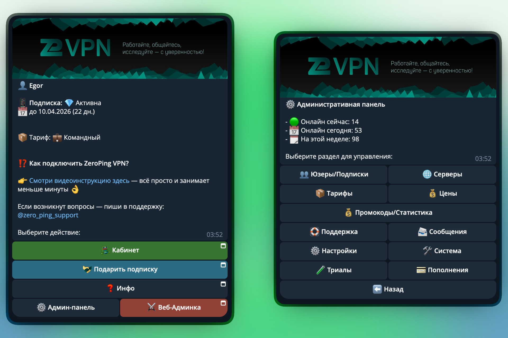
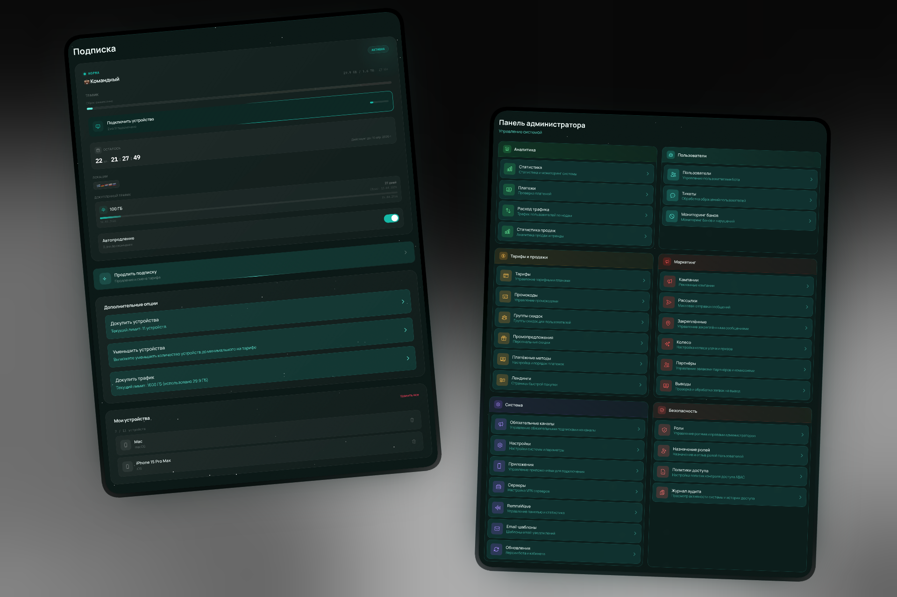

<div align="center">


# Bedolaga Bot

**Telegram-бот для автоматизации VPN-бизнеса на базе [Remnawave](https://github.com/remnawave/backend)**

Принимает оплату, выдаёт подписки, управляет пользователями — пока вы спите.

[](https://python.org)
[](https://postgresql.org)
[](https://docs.bedolagam.ru/getting-started/docker-deployment)
[](LICENSE)

[📖 Документация](https://docs.bedolagam.ru) · [🤖 Тестировать бота](https://t.me/zero_ping_vpn_bot?start=Git) · [💬 Чат сообщества](https://t.me/+wTdMtSWq8YdmZmVi)

</div>

---

## 🧩 Что такое Bedolaga?

Bedolaga — полнофункциональная платформа для продажи VPN-подписок через Telegram. Бот интегрируется с панелью [Remnawave](https://github.com/remnawave/backend) и берёт на себя весь цикл: от регистрации пользователя до автопродления подписки.

> 🖥 **[Bedolaga Cabinet](https://github.com/BEDOLAGA-DEV/bedolaga-cabinet)** — веб-кабинет на React + TypeScript, который существенно расширяет возможности бота: личный кабинет, OAuth-авторизация (Google, Yandex, Discord, VK, Telegram OIDC), лендинги, аналитика продаж, RBAC и подарочные подписки.

<div align="center">



</div>

---

## ✨ Возможности

<table>
<tr>
<td width="50%" valign="top">

### 📦 Подписки и тарифы

- 🎯 Гибкие тарифные планы (от 14 дней до года)
- 📊 Трафик: безлимит, фиксированный лимит или пакеты
- 📱 Управление устройствами (1–20 на подписку)
- 🌍 Автовыбор сервера или ручной выбор
- 🆓 Пробный период с конвертацией в платный
- 🛒 Умная корзина — сохраняет выбор при недостатке баланса
- 🔄 Автопродление за 3 дня до окончания
- 🎁 Подарочные подписки

</td>
<td width="50%" valign="top">

### 💳 Платежи

- 🏦 **14 платёжных провайдеров** одновременно
- 💰 Единый баланс: пополнение любым способом → покупка с баланса
- ⚡ Автопокупка подписки после пополнения
- 💾 Рекуррентные платежи (сохранённые карты)
- 🧾 Фискализация через НалоGo (для самозанятых)
- 🔍 Автопроверка статуса платежей
- 🛍 Гостевые покупки через лендинги

</td>
</tr>
<tr>
<td width="50%" valign="top">

### 📣 Маркетинг и продвижение

- 🏷 Промокоды (деньги, дни подписки, триалы)
- 👥 Реферальная программа с выводом средств
- 📨 Рассылки по сегментам пользователей
- 🌐 Кастомные лендинги с аналитикой
- 🎮 Конкурсы и ежедневные игры с призами
- 🎯 Персональные предложения и скидки
- 📈 Маркетинговые кампании с трекингом

</td>
<td width="50%" valign="top">

### 🛠 Администрирование

- 🤖 Панель управления прямо в Telegram
- 👤 Управление пользователями, подписками, платежами
- 📬 Уведомления в топики: покупки, продления, пополнения
- 💾 Автобэкапы БД с восстановлением из бота
- 🚧 Режим техработ (авто-детект недоступности панели)
- 📡 Мониторинг трафика и аномалий
- 🤝 Партнёрская программа
- 🔐 RBAC: роли и гранулярные права доступа

</td>
</tr>
</table>

---

## 💳 Платёжные провайдеры

<div align="center">

| | Провайдер | Методы оплаты | Валюта |
|:---:|:---|:---|:---:|
| ⭐ | **Telegram Stars** | Звёзды Telegram | XTR |
| 🏦 | **YooKassa** | Карты, СБП | RUB |
| 🏦 | **YooKassa СБП** | Система быстрых платежей | RUB |
| 🪙 | **CryptoBot** | USDT, TON, BTC, ETH | Crypto |
| 🪙 | **Heleket** | USDT, мульти-сеть | Crypto |
| 💳 | **CloudPayments** | Карты, 3D-Secure | RUB |
| 💳 | **Freekassa** | NSPK СБП, карты | RUB |
| 💳 | **Kassa AI** | СБП, карты, SberPay | RUB |
| 💳 | **PayPalych (Pal24)** | Карты, СБП | RUB |
| 💳 | **Platega** | Карты, СБП, крипто | RUB |
| 💳 | **WATA** | СБП, Карты | RUB |
| 💳 | **MulenPay** | Карты | RUB |
| 💳 | **RioPay** | Карты | RUB |
| 💳 | **SeverPay** | СБП, карты | RUB |
| 📲 | **Tribute** | Telegram-платежи | RUB |

</div>

> Все провайдеры работают параллельно через единый веб-сервер на порту 8080. Подробная настройка — в [документации](https://docs.bedolagam.ru/bot/payments).

<div align="center">
<table>
<tr>
<td align="center">


**🤝 Официальный партнёр WATA**

Bedolaga — официальный партнёр платёжной системы **WATA**.<br>
Пользователи бота получают **бесплатное подключение** по кодовому слову **`bedolaga`**

📩 По вопросам: [@wyrz_wata](https://t.me/wyrz_wata)

</td>
</tr>
</table>
</div>

---

## 🚀 Быстрый старт

```bash
git clone https://github.com/BEDOLAGA-DEV/remnawave-bedolaga-telegram-bot.git
cd remnawave-bedolaga-telegram-bot
cp .env.example .env   # заполните переменные
docker compose up -d
```

📖 Подробнее: **[Развёртывание →](https://docs.bedolagam.ru/getting-started/docker-deployment)** · **[Переменные окружения →](https://docs.bedolagam.ru/getting-started/environment)**

---

## 🏗 Стек

| | Компонент | Технология |
|:---:|:---|:---|
| 🐍 | Язык | Python 3.13, полностью async |
| 🤖 | Telegram | aiogram 3.x |
| 🗄 | База данных | PostgreSQL + SQLAlchemy 2.x + Alembic |
| 🔴 | Кэш/очереди | Redis |
| ⚡ | Web-сервер | FastAPI (webhook, платежи, Cabinet API) |
| 📝 | Логирование | structlog |
| 🐳 | Контейнеризация | Docker + Docker Compose |
| 🧹 | Линтер | ruff |

---

## 🖥 Bedolaga Cabinet

<div align="center">

[](https://github.com/BEDOLAGA-DEV/bedolaga-cabinet)

<br>



</div>

Веб-кабинет на **React + TypeScript**, существенно расширяющий возможности бота:

| | Возможность | Описание |
|:---:|:---|:---|
| 👤 | **Личный кабинет** | Подписки, баланс, устройства, реферальная программа |
| 🔑 | **OAuth-авторизация** | Google, Yandex, Discord, VK, Telegram OIDC |
| 🌐 | **Лендинги** | Кастомные страницы для привлечения клиентов |
| 📊 | **Админ-панель** | Аналитика продаж, RBAC, управление контентом |
| 🎁 | **Подарки** | Покупка и отправка подписок другим пользователям |
| 🔍 | **Поиск платежей** | Поиск по инвойсу, клиенту с фильтрами и статистикой |

---

## 📚 Документация

| | Раздел | Описание |
|:---:|:---|:---|
| 🚀 | [Быстрый старт](https://docs.bedolagam.ru/getting-started/quickstart) | Развёртывание за 5 минут |
| 💳 | [Настройка платежей](https://docs.bedolagam.ru/bot/payments) | 14 провайдеров, webhook, фискализация |
| 📦 | [Подписки и тарифы](https://docs.bedolagam.ru/bot/subscriptions) | Конфигурация планов и трафика |
| 👥 | [Реферальная программа](https://docs.bedolagam.ru/bot/referral-program) | Партнёрка и вывод средств |
| 🖥 | [Cabinet](https://docs.bedolagam.ru/cabinet/overview) | Настройка веб-кабинета |
| 🏷 | [Промо-система](https://docs.bedolagam.ru/bot/promo-system) | Промокоды, предложения, скидки |
| 🔌 | [API Reference](https://docs.bedolagam.ru/api-reference/overview) | REST API для внешних интеграций |

<div align="center">

**📖 Полная документация: [docs.bedolagam.ru](https://docs.bedolagam.ru)**

</div>

---

## 💬 Сообщество

<div align="center">

[](https://t.me/+wTdMtSWq8YdmZmVi)
[](https://github.com/BEDOLAGA-DEV/remnawave-bedolaga-telegram-bot/issues)

</div>

- 🐛 **Баги и предложения** — [GitHub Issues](https://github.com/BEDOLAGA-DEV/remnawave-bedolaga-telegram-bot/issues)
- 💬 **Вопросы и обсуждения** — [Telegram-чат](https://t.me/+wTdMtSWq8YdmZmVi)
- 🤖 **Тестирование** — [@zero_ping_vpn_bot](https://t.me/zero_ping_vpn_bot?start=Git)

---

<div align="center">

**[MIT License](LICENSE)** — используйте свободно для личных и коммерческих проектов.

</div>
